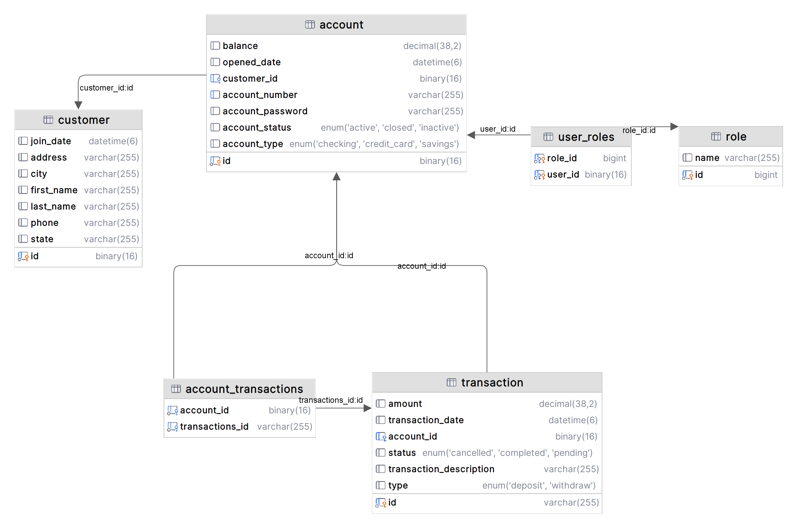
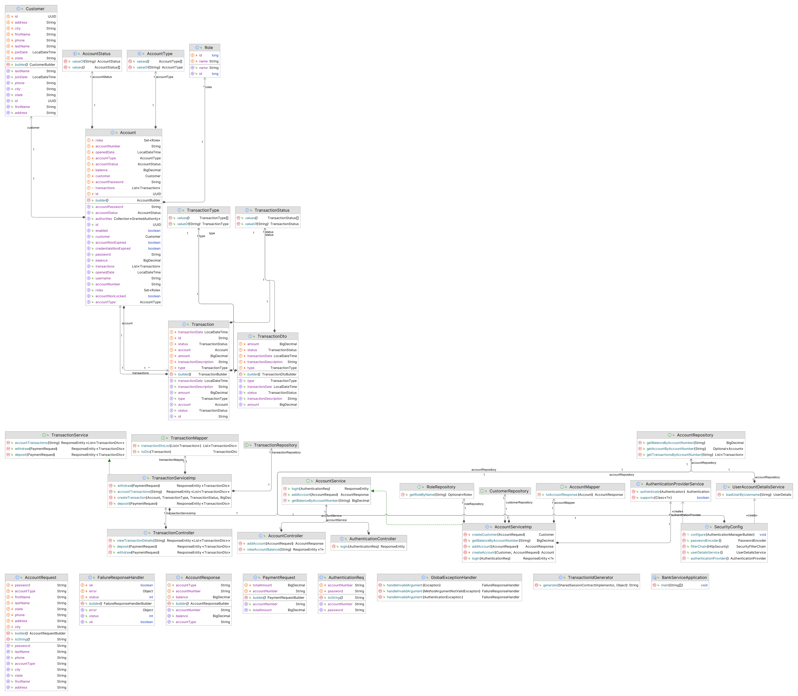

# Bank Service API

### **Overview**
This project is a basic banking service implemented using MySQL for data storage and Spring Boot for the backend. It provides functionality for adding accounts, creating transactions (deposits/withdrawals), logging transactions, account login, and viewing account balance and transaction details.

### **Features**
  * Add Account
  * Create Transaction
      - Types: Deposit, Withdrawal
      - Notes: Additional information about the transaction
      - Transaction Logging: All transactions are logged
  * Account Login
  * View Account Balance 
  * View Transaction History

### **Technology**
  * Spring Boot
  * MySQL
  * Swagger
  * Lombok
  * mapstruct

### **Swagger ApI**
<a href="https://muhammed-safwat.github.io/Bank-Service-Project/"> API Documentation </a>

### Database Tables

### Class Diagram

